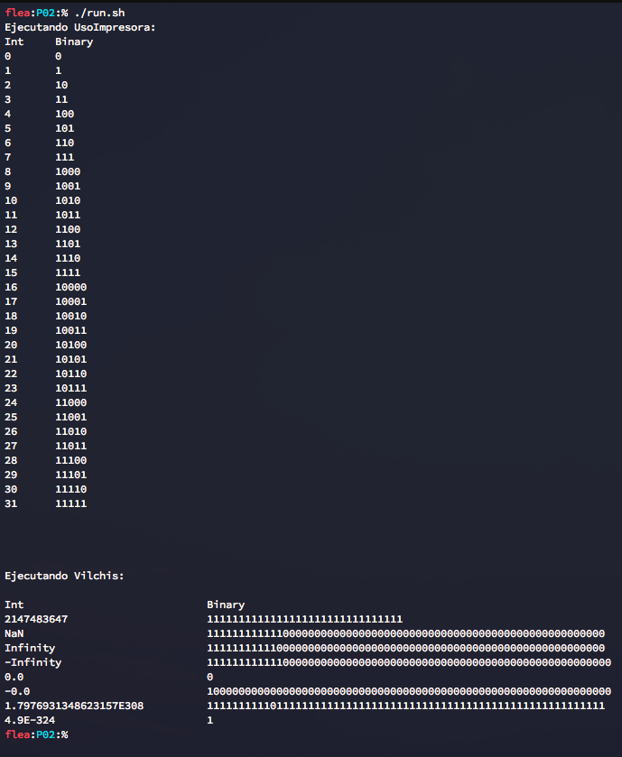

# Uso de la clase `ImpresoraBinario`

Demostración del uso de la clase `ImpresoraBinario` que se utilizará
en la práctica 02. En el ejemplo implementado se recorren todos los
números desde 0 hasta 31 y se muestra su representación en binario
usando el método `imprime` de la clase utilitaria.

## Uso del folder

Este folder incluye un script sencillo que realiza la compilación
de las clases seguido de la ejecución del programa. Para correr
el script realizar lo siguiente:

1. `$ chmod +x run.sh` Habilita el archivo `run` como ejecutable
2. `$ ./run.sh` Compila y corre el programa.

## Contenido del folder

* **`aux-files`** contiene el archivo original proveído en la práctica
* **`P02`** es el folder con el resultado de extraer el archivo e incluye
un archivo con el ejemplo de uso de la clase `ImpresoraBinario`
* **`PO2/src/icc/primitivos/UsoImpresora.java`**: Archivo de ejemplo
* **`PO2/src/icc/primitivos/Vilchis.java`**: Ejemplo del ayudabte

## Recursos

* **[Java primitive data types (official docs)](https://docs.oracle.com/javase/tutorial/java/nutsandbolts/datatypes.html)**

## Screenshots

